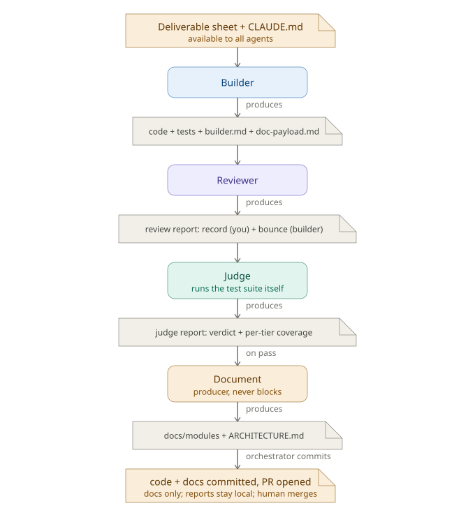

# The build loop

This page frames the build phase for a human: what it is, the choices it offers, and the trade-offs behind them. The exact rules live in the contracts and are linked throughout; this page summarises and points, it does not restate. The source of truth is [`../contracts/build-judge-loop.md`](../contracts/build-judge-loop.md) (the core), with the profile deltas in [`../contracts/build-loop-full.md`](../contracts/build-loop-full.md) and [`../contracts/build-loop-lite.md`](../contracts/build-loop-lite.md).

The build phase delivers a sheet one increment at a time: a single loop, one [per-increment cycle](roles.md), one set of gates, one `.building/` workspace, one checkpoint. It is always attended, a human decides at every checkpoint. With a GitHub remote the human merges every PR and the merge is the final gate; with no remote the loop commits each increment locally and the judge's pass is the gate.

## The per-increment cycle

The four roles and their ordering are summarised in [roles.md](roles.md); the full cycle, budgets and escalation are in the core contract (Flow). In short: builder, then reviewer (can bounce), then judge (runs the tiers, proves tests aren't hollow), then document, then commit and PR (or local integration). Either loop exhausting three attempts escalates and freezes that increment's dependents. The per-increment state machine is [`diagrams/increment-states.svg`](diagrams/increment-states.svg).

The same cycle seen as an artifact flow, what each role produces and hands to the next (the commit carries code and docs, the reports stay local under `.building/`):

## Two modes: what you are choosing

`mode` is a per-queue setting (sequential-attended default, or parallel-attended); the mechanics are in the core contract (Modes). The choice is about control, not speed:

- **sequential-attended** builds one increment at a time, each on the previous one's merged code, and keeps main provably green after every merge. It fits work that genuinely builds on itself.
- **parallel-attended** decouples build order from merge order: an increment becomes eligible the moment its dependencies are merged, and you can build a fan-out of independent increments back to back, leaving their PRs open to merge as a batch. It fits a wide set of independent increments.

**Parallel means eligible, not concurrent.** It is still one build at a time with a checkpoint between each, never simultaneous builds. The trade is honest: parallel green is per-branch, so two siblings each green alone can combine into a red main, reconciled at the next judge run or a final combined run (Monotonic green in the contract). Sequential pays for its always-green main by serialising. See [`diagrams/git-topology.svg`](diagrams/git-topology.svg) and [`diagrams/parallel-topology.svg`](diagrams/parallel-topology.svg).

## GitHub is optional

A remote is not required to build. The loop detects remote presence itself and picks a flow; this is an environment fact, not a mode. The detection rule and the per-flow behaviour are in the core contract (Remote presence). The human-relevant points:

- **With a remote**: each increment is a PR into main that you merge.
- **No remote**: the loop commits each increment to local main itself, no push, no PR, so the checkpoint never offers **Merge the PR**. The two modes coincide here (no open PRs, so nothing to decouple). Adding a remote later resumes the PR flow for subsequent increments.

## Build profiles: full and lite

`profile` is a per-queue setting orthogonal to `mode` (full default, or lite); the mechanics are in [build-loop-full.md](../contracts/build-loop-full.md) and [build-loop-lite.md](../contracts/build-loop-lite.md). The choice is verification depth vs iteration speed:

- **full** verifies and documents every increment before it ships (both tiers, docs, per increment). No completion gate. The thorough default.
- **lite** gates each increment on the unit tier only and defers the integration tier and the docs to a single **completion gate** at the end, so no live endpoint is needed while iterating. The deferrals are reconciled before the queue is declared complete.

The trade is honest: lite buys speed at the cost of per-increment integration-green and per-increment docs, both established once at the end rather than each increment.

## Multiple queues

A project can hold several feature queues at once, each its own sheet and state, built and completed independently. The per-queue isolation and the three project-wide shared things (setup, main's greenness, the cross-queue checkpoint reminder) are in the core contract (Multiple feature queues).

## The dependency graph

The sheet's `depends_on` edges form a DAG, acyclic by schema validation, which is what guarantees the loop can never deadlock. An increment is eligible when all its dependencies are merged; merging one frees its dependents. The checkpoint board is this graph filtered by what is merged. The document agent renders the same graph as Mermaid into `docs/ARCHITECTURE.md`.

## The checkpoint

After every increment, and on entry and on reclaim, the loop renders a checkpoint: a board (rendered verbatim from a template so it reads identically across conversations) then a fixed decision widget. The board's four sections, the widget verbs and their per-mode applicability are specified in the core contract (Checkpoint); the human point is that the wording never changes between conversations, and the only mode difference is when **Carry on** / **Build a specific one** appear (always in parallel when the ready set is non-empty; in sequential only when nothing else is in flight). See [`diagrams/checkpoint.svg`](diagrams/checkpoint.svg).

## Validating the loop itself

Before a real build, exercise the orchestration on a trivial increment. [`../examples/smoke-test-sheet.md`](../examples/smoke-test-sheet.md) is a one-increment sheet (a function returning 42 with a unit test) that runs the whole loop quickly. If it passes cleanly the orchestration works; if it breaks you have found the problem on a trivial case.

## Recovery

The loop is robust to interruption and keeps you in control. Re-running after an interruption reads `state.json`, reconciles open PRs, finds where it stopped, and renders the checkpoint before doing anything; declining (Wait) changes nothing. An escalated increment waits for your fix on its branch, then re-enters verification from the reviewer. The full resume and escalation-recovery rules are in [`../contracts/build-judge-loop.md`](../contracts/build-judge-loop.md) (Resume, Escalation recovery).

## Where the loop keeps its work

Everything the loop generates lives under one gitignored folder, `.building/`; commits carry only the increment. See [building-folder.md](building-folder.md).

## Tests

Two tiers (unit, integration), the judge's responsibility; the rules are in the judge contract (judge.md, Test tiers). Unit runs anywhere, integration needs live endpoints, a tier that should have tests but selects zero is a hollow suite and fails.
