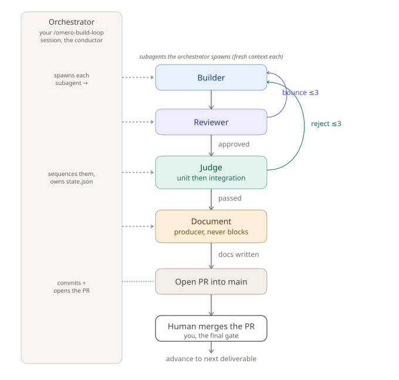

# The build loop

The build phase delivers a sheet one increment at a time. It is a single loop with a single [per-increment cycle](roles.md), one set of gates, one `.building/` workspace and one checkpoint. A per-queue `mode` selects between two behaviours that differ in exactly one thing: what the loop offers after a PR opens.

Both modes are attended. With a GitHub remote a human merges every PR, and the merge is the final gate; with no remote the loop builds and commits each increment locally and the judge's pass is the gate (see [GitHub is optional](#github-is-optional)). Either way the human decides at every checkpoint.

## The per-increment cycle

For each increment: the builder implements and writes tests; the reviewer reviews (budget 3, bounce on a critical or major finding with evidence); on approval the judge runs the unit tier then the integration tier and proves the tests are not hollow; on a pass the document agent runs; the orchestrator commits code and docs and opens a PR into main (or, with no remote, integrates the increment into local main). Either the review or the judge loop exhausting three attempts escalates and freezes that increment's dependents. This cycle is identical in both modes; the profile changes only the integration tier and when docs run. The per-increment state machine is [`diagrams/increment-states.svg`](diagrams/increment-states.svg). The cycle above is the full profile; the lite profile defers the integration tier and the documentation to a completion gate (see [Build profiles](#build-profiles-full-and-lite)).

## Two modes, one difference

`mode` lives in each feature's `state.json`, set per feature queue and persisting across conversations. It is not an invocation flag. The loop reads it and never writes it; if it is absent the loop defaults to sequential-attended. One queue can run parallel-attended while another runs sequential-attended.

| | sequential-attended (default) | parallel-attended |
| --- | --- | --- |
| In flight at once | one increment | several |
| After a PR opens | wait; do not cut the next branch until that PR merges | you may build any ready sibling while open PRs sit unmerged |
| Each branch cut from | updated origin/main (after the previous merge) | a freshly-fetched origin/main, never stacked on a sibling |
| main greenness | green after every merge | green after the combined re-run (see below) |
| When it fits | each increment builds on the previous one's merged code | a wide fan-out of independent increments |

Everything else, the four roles, the gates, the budgets, the `.building/` layout, the hollow-test, the board and the widget mechanism, is the same. The single behavioural fork is the cut rule at the checkpoint. See [`diagrams/git-topology.svg`](diagrams/git-topology.svg) for the sequential topology and [`diagrams/parallel-topology.svg`](diagrams/parallel-topology.svg) for the parallel one. The table describes the GitHub flow; with no remote the two modes coincide (see [GitHub is optional](#github-is-optional)).

## Parallel means eligible, not concurrent

Parallel-attended does not run builds at the same time. It is still one checkout and one build at a time, with a checkpoint between each. What "parallel" names is that an increment becomes **eligible** the moment all its dependencies are merged, and the loop will offer every eligible increment rather than forcing you to merge one before starting the next.

The win is not a wall-clock speedup. It is decoupling build order from merge order: you can build `gridfs-store`, `oplog-peek` and `rbac-roles` back to back, leaving their PRs open, and merge them as a batch when you are ready. In sequential mode each build waits behind the previous merge. Same total work, different control over when merges happen.

The trade is honest. In parallel mode green is per-branch, not per-main: each sibling is verified green only against the main it was cut from, in isolation. Two siblings that are each green alone can combine into a red main (a shared-file append, or a semantic collision the loop never sees because it never holds two siblings together). The combined suite is re-run at the next increment's judge run; when the merged siblings are terminal, the human runs the full suite once after the final combine. Sequential keeps main provably green after every merge and pays for it by serialising.

## GitHub is optional

A remote is not required to build. The setup gate proves git, a local main, `gh` auth and commit identity, but only warns when the origin remote is missing and still writes the receipt, so the receipt does not tell the loop whether a remote exists. The loop detects it itself on entry and picks one of two flows. This is not a mode (mode is sequential vs parallel); it is an environment fact the loop reads.

- **With a remote**: the GitHub flow, the default. Each increment is cut from a freshly-fetched `origin/main`, pushed and opened as one PR into main; you merge it; the loop reconciles against the remote.
- **No remote**: the local-only flow. The loop warns once that no remote is configured, so nothing can be pushed or PR'd yet, then continues locally. It cuts each branch from local main, builds and commits the increment and integrates it into local main itself (a fast-forward), with no push and no PR. The local commit is the increment's terminal state, so it goes straight to `merged` (meaning "on local main") with no `pr-open` stage, and the checkpoint never offers **Merge the PR** because there is nothing to merge. Not every increment ends up pushed or PR'd, which is expected.

In the local-only flow the two modes coincide: with no open PRs there is no merge order to decouple from build order, so the loop integrates each increment as soon as it is committed and cuts the next branch from the updated local main, keeping main green after every increment. Adding a remote later resumes the full push/PR flow for subsequent increments; increments already committed locally stay on main and are pushed with it when you first push.

## Build profiles: full and lite

Like `mode`, a `profile` lives in each feature's `state.json`, set per queue and persisting across conversations. The loop reads it and never writes it; absent, it defaults to full. It is orthogonal to `mode`: a queue can be lite and parallel, or full and sequential, in any combination.

- **full** (default): every increment is fully verified and documented before it ships. The judge runs both the unit and the integration tier per increment, the document agent runs per increment, and the commit carries code and docs. There is no completion gate, because each increment is already integration-green and documented.
- **lite**: a fast iteration path. Per increment the judge gates with the type-check, the unit tier and the hollow-test only; it defers the integration tier, so no live endpoint or Docker is needed while iterating. The document agent is deferred too (the builder still writes its cheap `doc-payload.md` slice, so nothing is lost), and the commit carries code only.

lite reconciles both deferrals at a **completion gate**, once every increment is merged and before the queue is declared complete. The loop tracks the gate in a `completion` block in `state.json`, so a fresh conversation picks it up rather than re-running it. First the full accumulated integration suite runs once against the finished main and must pass (a failure is fixed by adding a normal increment to the sheet, which builds and merges before the gate re-runs); then a documentation sweep runs the document agent across every increment from its `doc-payload.md` slice in one pass. With a remote the sweep opens one docs PR (on a `docs/<feature>-completion` branch) that you merge like any other PR, shown in the checkpoint's AWAITING MERGE; with no remote the loop commits the docs to local main itself. So a lite queue is unit-green throughout and integration-green at completion, deferring integration much as parallel-attended defers its combined re-run, though established once at the end rather than at each post-merge judge run.

The trade is honest. lite buys speed (no per-increment integration tier, no per-increment docs) at the cost of per-increment integration-green and per-increment docs, both reconciled before the feature ships. full stays the default and the thorough per-increment pass.

## Multiple queues

A project can hold several feature queues at once, each a sheet under `.building/features/<feature-name>/` with its own state at `.building/build/<feature-name>/`. You pick the queue by the sheet path you pass the loop; queues are built, resumed and completed independently, and one never reads or writes another's state. `mode` is per queue, so a large queue can run parallel while a small one runs sequential.

Three things stay project-wide. Setup is proven once for the project (the receipt and the runners are shared), so the receipt's head-drift warning is expected once a sibling queue has merged into the shared main, and is not a reason to re-run setup unless the tooling actually changed. main is one tree, so green is project-wide: every branch is cut from the shared main and the judge's accumulated suite spans all queues' merged work. And the board shows only the active queue, so each checkpoint also carries a one-line reminder of any other queue with open work (in flight, awaiting merge, escalated or blocked), so nothing is silently forgotten.

## The dependency graph

The sheet's `depends_on` edges form a DAG: roots at the top (increments with no dependencies), edges fanning down to terminals (increments nothing depends on). It is acyclic by schema validation, which is what guarantees the loop can never deadlock, there is always a next eligible node until everything is merged.

An increment is eligible when all its dependencies are merged. Merging an increment frees its dependents. The loop offers any eligible node; in sequential it offers them one merge at a time, in parallel it offers the whole eligible set.

The document agent already generates this graph as Mermaid into `docs/ARCHITECTURE.md` from `depends_on`. The checkpoint board is that same graph filtered by what is merged: the ready set is the eligible frontier, the blocked set is everything still waiting upstream, and the starred chain is the longest root-to-terminal path through it.

## The checkpoint

After every increment (a PR opening with a remote, a local commit without one), and on entry and on reclaim after an interruption, the loop renders a checkpoint: a board, rendered verbatim from an on-disk template so it reads identically across conversations, then a fixed decision widget. The board sorts every increment by state into READY, AWAITING MERGE, BLOCKED and POSSIBLY STALLED, with the critical-path chain starred. See [`diagrams/checkpoint.svg`](diagrams/checkpoint.svg).

The widget shows only the applicable verbs, with Wait always available:

- **Carry on** builds the lowest-id ready increment, no choosing.
- **Build a specific one** lets you name which ready increment.
- **Merge the PR** merges (you are the gate), then the loop reconciles. It appears only with a remote; in the local-only flow there is no PR to merge.
- **Resume the stalled one** resumes a possibly-stalled increment, routed by its actual status.
- **Wait** stops safely; nothing changes.

The only mode difference is when **Carry on** and **Build a specific one** appear. In parallel-attended they appear whenever the ready set is non-empty, so you can keep building while PRs sit open. In sequential-attended they appear only when nothing else is in flight, so an open PR suppresses them and you must merge first. The labels never reword between conversations; identical wording is the point.

If subagent dispatch is unavailable the loop degrades to one increment per conversation (the roles run inline, so a second build would exhaust the context); you continue by starting a fresh conversation, which reclaims the run from `state.json` (and the remote, if one exists).

## Tests

Two tiers. Unit tests have no external dependencies and run anywhere; integration tests need live endpoints. One test file per module under test, co-located, tier by suffix (`<module>.test.ts`, `<module>.integration.test.ts`), with shared helpers in one support module. The judge runs unit first (cheap, fail fast), then integration. A tier that should have tests but selects zero is a hollow suite and fails.

## Where the loop keeps its work

Everything the loop generates while building (state, the agents' working files, escalation records) lives under one gitignored folder, `.building/`. None of it is committed; your commits and PRs carry only the increment (code, and docs in the full profile), never anything under `.building/`. See [`building-folder.md`](building-folder.md) for the full layout.

## Validating the loop itself

Before a real build, exercise the orchestration on a trivial increment. [`../examples/smoke-test-sheet.md`](../examples/smoke-test-sheet.md) is a one-increment sheet (a function returning 42 with a unit test) that runs the whole loop quickly: branch cut, builder, reviewer, judge, document, then PR and merge with a remote (or a local commit to main without one). If it passes cleanly the orchestration works; if it breaks you have found the problem on a trivial case.

## Recovery

The loop is robust to interruption and keeps you in control at both recovery points. After an interruption (crash, closed terminal, a new conversation continuing a run) re-running reads `state.json`, reconciles any open PRs against the remote (a no-op in the local-only flow, where nothing is ever pr-open), finds where it stopped, and renders the checkpoint before doing anything; declining (Wait) is safe and changes nothing. When an increment escalates after three failed attempts the loop waits: you fix it on its existing branch and tell it to continue, and the fix re-enters verification from the reviewer (reviewed and judged, never waved through). Full resume and escalation-recovery behaviour is in [`../contracts/build-judge-loop.md`](../contracts/build-judge-loop.md).
