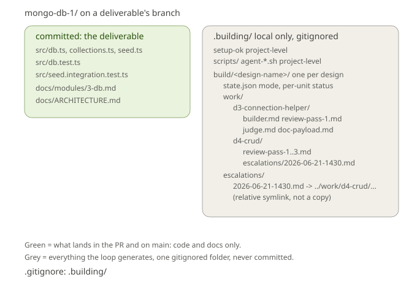

# The .building folder

Everything the build loop generates while it works, plus the feature sheets it builds from, lives under one folder: `.building/`. It is gitignored in full, so none of it is ever committed. Your commits and pull requests carry only code and docs, the actual increment. `.building/` is the loop's private workspace on your machine.



## Structure

```
.building/
  setup-ok                        the setup receipt (project-level, proves the environment was ready)
  scripts/                        the loop's own runners (project-level, never committed; setup places the test and hollow-check runners, the judge places the type-check runner)
    agent-tests.sh                the judge's terse test runner
    agent-hollow.sh               the judge's hollow-check runner
    agent-typecheck.sh            the judge's type-check runner
  features/                       the feature sheets, one folder per feature
    greeting-spike/               keyed by the feature name
      increments.md             the schema-valid sheet the loop builds
  build/                          the loop's own state, one folder per feature (feature queue)
    greeting-spike/               mirrors features/greeting-spike/
      state.json                  this queue's mode, sheet/conventions paths, per-unit status, loop counts, branches
      work/                       the agents' working files, one folder per unit
        db-pool-connection-helper/     keyed by the audit-named branch
          builder.md              what the builder did
          review-pass-1.md        the reviewer's record for each pass
          judge.md                the judge's verdict (written on pass)
          doc-payload.md          the builder's slice for the document agent
        db-crud/
          review-pass-1..3.md
          escalations/            present only if this unit escalated
            2026-06-21-1430.md    the escalation record (single source of truth)
      escalations/                this queue's flat chronological index
        2026-06-21-1430.md  ->  ../work/db-crud/escalations/2026-06-21-1430.md
```

## The parts

**features/** holds the feature sheets the build loop builds from, one folder per feature, keyed by a short kebab-case feature name you give the design partner (so `greeting-spike`, not a path). The design partner writes `increments.md` here; re-running the same feature name overwrites it, and different features sit side by side. The sheet is the build's input, but it lives under gitignored `.building/` like everything else in the pipeline workspace, so it stays local rather than being committed.

**build/** is the loop's own bookkeeping, one folder per feature so two features never overwrite each other. `build/<feature-name>/` mirrors `features/<feature-name>/`: a `state.json` for that feature queue (its structure is [`../contracts/state.schema.md`](../contracts/state.schema.md)), its `work/` folders, and its `escalations/` index. The state file carries that queue's `mode` (sequential-attended or parallel-attended, set per queue and persisting across conversations) alongside the sheet and conventions paths, and tracks where each unit is (its status, how many review and judge attempts it has had, its branch name). The loop knows which queue you mean from the sheet path you pass it, so switching features never touches another's state. `setup-ok` and `scripts/` sit one level up, at the top of `.building/`, because setup proves the project (not a feature) and every queue shares it.

**scripts/** holds the loop's own runners: the agent test runner the judge uses for its terse verification passes, the hollow-check runner it uses for the negative run, and the type-check runner it runs as a gate before the tiers. They are project-level (the same runners serve every feature), so they sit at the top of `.building/`, not under any one feature. The setup gate writes the test and hollow-check runners here from the shared templates and proves them; the type-check runner is placed and run by the build loop's judge. They are loop machinery, not part of the project, so they live under gitignored `.building/` rather than the committed `scripts/`, which carries only the project's own scripts.

**work/** is where the agents record what they did, one folder per unit, named after that unit's audit-named branch (so `db-pool-connection-helper`, not an opaque `build/3`). The builder, reviewer, judge, and document agent each write their file here. These files ARE the record: there is no second copy kept anywhere. Re-running a unit overwrites its folder, only the latest run is kept. Within one run, the review passes accumulate (review-pass-1, review-pass-2, and so on) so you can see the back-and-forth.

**escalations/** is a convenience index, one per feature queue at `build/<feature-name>/escalations/`. When a unit escalates (a review or judge loop hit its limit), the escalation record is written once, inside that unit's own folder at `build/<feature-name>/work/<branch-name>/escalations/<date-time>.md`. A symlink of the same name is then placed in that queue's `escalations/`, so you can list every escalation in the queue in date order without hunting through the work folders. The symlink is a relative pointer (`../work/...`), not a copy, so the real file stays in one place and the folder can be moved or renamed without breaking the links.

## Why one folder

Before, loop output was scattered across three hidden folders and copied between two of them, which made it unclear what was a working file, what was a kept record, and what was committed. Now there is one rule to remember: everything the loop produces is under `.building/`, and `.building/` is never committed. The gitignore is a single line:

```
.building/
```

## What you actually read

If you want to see how a unit was built, open `build/<feature-name>/work/<branch-name>/` and read the files in order: builder, review passes, judge. If you want to see what has gone wrong in a queue, list `build/<feature-name>/escalations/`. You will not normally need to touch `build/`, that is the loop's own state, though a queue's `state.json` is readable if you want to see its progress at a glance.
