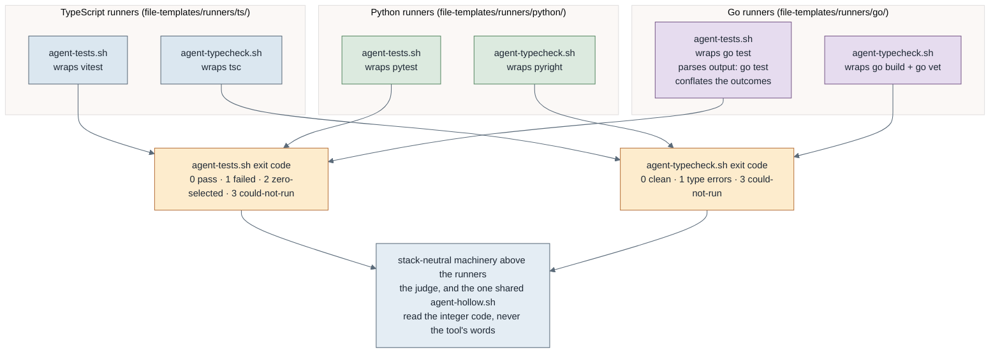

# The Go build path, end to end

How a Go project goes through the same four phases the pipeline uses for TypeScript and Python, with only the underlying commands changing. The stack-agnostic core (the design partner, the increment-sheet schema, the orchestrator, the checkpoint, modes, profiles, the state schema) never learns the word "Go": all stack knowledge lives in the generator and in the runners the setup gate places. This page is the human walkthrough; its executable form is the `tests/go-e2e-proof` suite, which runs the real pieces.

## The four phases, pointed at Go

1. **Create.** `/omero-create-go-project <name> [--sqlite] [--react] [--http]` runs `scripts/init-go-project.sh`, the third generator. It scaffolds a single-binary module: `go.mod` as the stack marker, `cmd/<app>/main.go` as the only executable with everything real under `internal/`, `internal/assets/` embedding the static client with `embed.FS`, a trivial exported function with a co-located table-driven test so the unit tier is never hollow, a Makefile, and git on `main`. The layers are additive: `--sqlite` adds a `modernc.org/sqlite` store with migration and an in-process integration tier, `--react` adds a Vite client under `client/`, and `--http` adds a `net/http` server and replaces the entry point with its bootstrap.

2. **Design.** `/omero-design-sheet` is unchanged: it converges intent into a schema-valid increment sheet. It is stack-agnostic and emits the same sheet shape regardless of stack. `/omero-review-sheet` reviews it for design soundness before build, also stack-agnostic.

3. **Setup.** `/omero-setup-project` runs the gate, which detects the stack from `go.mod`, sources `scripts/setup/go.sh`, and proves the environment by execution: `go mod tidy` resolves the module, `go build ./...` compiles it, both tiers run and select a non-zero count, coverage runs, and the three agent runners (test, type-check, hollow) are placed from `file-templates/runners/go/` (and the shared hollow runner) and proved. On success it writes the same `.building/setup-ok` receipt as the other paths.

4. **Build.** `/omero-build-full` is unchanged: the orchestrator, branch-per-increment, checkpoint and judge loop are stack-agnostic. The judge runs the same discipline through the placed Go runners: the type-check gate first (`go build` plus `go vet`), then the unit tier, then the integration tier, proving a test fails on a deliberate fault (the hollow negative run) and distinguishing a real failure from an environment block. Only the commands underneath differ.

## What is genuinely different about Go

Three things do not simply mirror the Python path, and each is a deliberate choice rather than a gap.

### Tiers split by build tag, not directory

Go co-locates `foo_test.go` beside `foo.go`, so a `tests/unit` and `tests/integration` directory split would fight the language. The tier split is by build tag instead: the unit tier is every untagged test (`go test ./...`), and the integration tier is the files carrying `//go:build integration` (`go test -tags=integration ./...`). Everything above the runners is unaffected, because the runner still answers `unit` and `integration` and still returns the same four exit codes. The setup gate's "is the integration tier declared" question becomes a source grep for the tag rather than a directory test.

### `go test` conflates outcomes, so the runner classifies by output

This is the load-bearing piece of the whole path. `go test` returns only two exit codes worth anything, and both are ambiguous:

- It exits **0** for a package with **no test files at all**. A hollow suite is indistinguishable from a passing one by exit code alone.
- It exits **1** for both a **genuine assertion failure** and a **build error in a test package**. A broken compile is indistinguishable from a real failure by exit code alone.

The contract in `contracts/agent-runner.md` needs those four outcomes kept apart, because the judge treats them completely differently: a failure is bounced to the builder and consumes an attempt, an environment problem is not. So `file-templates/runners/go/agent-tests.sh` parses the output: an `ok  ` line means tests actually ran, `[build failed]` or `[setup failed]` or a `# package` banner means the tier could not run (3), `--- FAIL:` means a real failure (1), and exit 0 with no `ok` line means zero selected (2). `tests/go-runners` proves each of the four against a real Go package, because the conclusion the judge reaches rests entirely on this mapping being right.

### The type-check gate is the compiler plus vet

Go has no separate type-checker: the compiler is the type system. `agent-typecheck.sh` is therefore `go build ./...` followed by `go vet ./...`, mapped onto 0 clean / 1 errors / 3 could-not-run. It is kept as a gate even though `go test` also compiles, because it fails fast, it covers packages with no test files at all, and `go vet` catches a class of defect (printf mismatches, lost cancel functions, bad struct tags) that compiles cleanly and would otherwise reach a green pass. A module whose dependencies cannot be resolved is separated out as exit 3, so a cold module cache with no network is never reported to the builder as a type error to fix.

## The scope granularity reconciliation

The shared `agent-hollow.sh` runs a **scoped** negative run: it plants a fault, then runs the tier against one test target. Its usage contract requires a test **file**, and it checks `-f` on the argument. But Go's unit of compilation is the **package directory**: `go test ./some/file_test.go` compiles that one file without the rest of its package and fails to build.

The reconciliation lives in the Go runner, not in the shared script: `agent-tests.sh` maps a file argument to its containing directory, and accepts a directory as is. Both forms are proved in `tests/go-runners`, because a regression there would silently break every hollow check on this stack. Nothing about `agent-hollow.sh` changes; it stays the one copy that serves every stack, parsing integers rather than words.

One consequence worth knowing when reading a judge's hollow result: because the scope is the package, a non-asserting test placed *beside* a real one is rescued by its neighbour and reports ASSERTS. The hollow check proves the package asserts, not that one specific function does.

## The seam that makes this work

The judge and the shared hollow runner read only the runners' **exit codes** (`contracts/agent-runner.md`): `agent-tests.sh` returns 0 pass / 1 failed / 2 zero-selected / 3 could-not-run; `agent-typecheck.sh` returns 0 clean / 1 errors / 3 could-not-run. Every stack's runners map their native tool onto those codes, so the one shared `agent-hollow.sh` classifies a negative run the same way for any of them. Adding a stack is a new generator plus a runner set honouring this contract; nothing above the runners changes.

## Two simplifications, so they are not mistaken for gaps

- **Coverage has no provider to install.** `go test -cover` is part of the toolchain, so the "derive the runner's version and install a matching coverage provider" step the TypeScript and Python modules perform has nothing to do here. The gate still *verifies coverage by running it*, per the contract's never-trust-an-install rule, and prints an explicit line so its absence is not read as a skipped check.
- **This stack declares no external endpoint.** The integration tier is in process: a temp SQLite file (removed by `t.TempDir()`) plus `httptest`. There is no service to bring up, so the BLOCKED-endpoint path is unreachable and setup never waits on anything. A Go project that later grows a real endpoint declares it in `CLAUDE.md` like any other.

## The single embed point

Everything the binary serves lives in `internal/assets/static/`, embedded with `//go:embed all:static`. Two consequences that are easy to trip over:

- A `//go:embed` pattern cannot contain `..`, so the embedding package must sit at or above what it embeds. That is why the client is *synced into* `internal/assets/static` by `make client-build` rather than embedded from `client/dist` directly. Embedding from inside `client/` would put a Go package in the Node tree and drag `client/node_modules` into every `go build ./...` walk.
- `//go:embed` fails at **compile** time on an empty match, so the generator commits a placeholder `internal/assets/static/index.html`. Without it a fresh clone would not compile until someone ran a Node build, which would put a Node toolchain on the path of every Go-only gate. Node stays a build dependency of the client and is absent from the shipped artefact.

## Definition of done, proved

`tests/go-e2e-proof` runs the chain on a real increment: scaffold the project, run the setup gate to a READY receipt proved by real `go build` and `go test`, add a typed package with a table-driven unit test, then run the judge's sequence through the placed runners (type-check clean, unit tier passes, hollow check ASSERTS on a real behavioural fault, and a deliberate type error is caught by the gate). It also asserts the stack-agnostic core contracts name no Go tooling, so the core stayed agnostic. `tests/go-runners` proves the four-code contract case by case, and `tests/init-go-project` proves each layer flag adds exactly its own files and that the scaffold builds, vets, tests and is gofmt-clean. Where the toolchain, `gh`, a git identity or the network is absent the live proofs are reported skipped, never silently passed.

Note: like `tests/py-e2e-proof`, this suite exercises the real generator, setup gate and judge runners directly rather than invoking `/omero-build-full`, because agent-sdlc is the meta-repo that defines the loop, not a project the loop builds. The pieces it runs are the same ones the loop uses.
