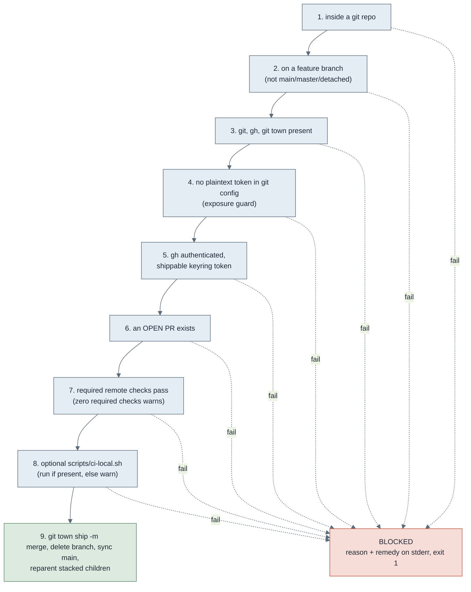

# Merge PR

`scripts/merge-pr.sh` ships the current branch's PR: it requires the PR's required
remote checks to pass, then runs `git town ship`. It is stack-agnostic, it verifies
status and merges and never builds or runs tests, so one gate serves this repo's
TypeScript and Python paths alike. Invoked via the `omero-merge-pr` skill.

The rules it enforces, the exit-code meanings, the exposure-prevention token guard and
the optional local-CI step are the contract's, in
[`../contracts/merge-pr.md`](../contracts/merge-pr.md). This page points at it rather
than restating it.

## Why it is a script, not a rule

A private repo on GitHub's free plan has no branch protection: a PR merges even when
its checks are red or missing. Merging only after checks pass is deterministic, not a
judgement call, so it belongs in a script that gates itself. The script is the gate;
the contract is its spec.

## Running it

```
merge-pr.sh                 ship the current branch's PR (message defaults to the PR title)
merge-pr.sh "squash msg"    ship with an explicit squash message
merge-pr.sh --dry-run       verify every gate and print the ship plan, merge nothing
merge-pr.sh --help          print the header
```

Exit codes: 0 shipped (or, under `--dry-run`, every gate passed), 1 BLOCKED (a gate
failed; the reason and remedy are on stderr), 2 bad usage. There is no
`--no-verify-local`: there are no local gates, CI is the check authority.

## The gate



The token guard (step 4) is the load-bearing one: a plaintext `git-town.github-token`
in `.git/config` is a real exposure that has happened once, so finding one is a hard
block with a rotate-and-remove remedy. It is separate from how the ship authenticates
(step 5): the token that ships is read transiently from the gh keyring via `gh auth
token` and passed to the `git town ship` child process only, never written to config or
disk. The contract has the full auth model.

Step 8 is the merge-time home for the heavy full-CI run. The pre-push hook runs only
the fast per-commit gates, so running `scripts/ci-local.sh` here is not a duplicate. It
is optional-by-presence to keep the gate stack-agnostic: a project that ships the script
gets a verbatim local CI run, one that does not simply skips the step. The skill never
creates `ci-local.sh`, it only runs an existing one.

`git town ship` merges only DIRECT children of main. If the branch is deeper in a
stack, git town refuses and the script surfaces that refusal; ship or delete the
ancestor branches first rather than forcing `--to-parent`.
