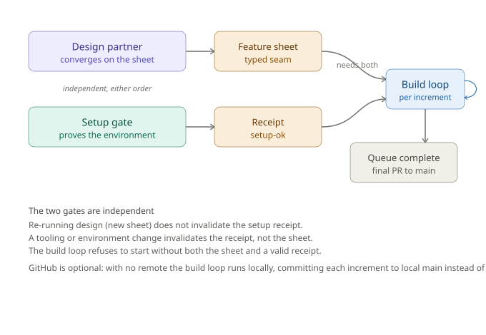

# The build pipeline

Three phases, two gates. Design and setup are independent prerequisites; both must be done before build, in either order. Each produces a gate artifact, and the build loop refuses to start without both.

## The three phases

1. **Design** (`/omero-design-partner`) converges a fuzzy intent into a feature sheet, written to `.building/features/<feature-name>/increments.md` where `<feature-name>` is a short kebab-case name you give the feature. Gate: the sheet, validated against [`../contracts/increment-sheet.schema.md`](../contracts/increment-sheet.schema.md).
2. **Setup** (`/omero-project-setup`) proves the environment is buildable by running things: tooling matches, the test tiers select non-zero tests, the agent test runner is placed and works, configs are valid, git is ready. It runs `scripts/project-setup.sh`. Gate: the receipt at `.building/setup-ok`. Idempotent, so it doubles as a re-runnable health check.
3. **Build** (`/omero-build-loop`) delivers the sheet one increment at a time. It checks the receipt on entry, then for each increment runs builder, reviewer, tiered judge, document, then a PR and your merge with a remote, or a local commit integrated into main without one. The loop runs in one of two modes, sequential-attended or parallel-attended, read from `mode` in `state.json`, and one of two profiles, full (the default) or lite, read from `profile`: lite defers the integration tier and the documentation to a completion gate. See [`build-loops.md`](build-loops.md).

The two gates are independent: re-running design (a new sheet) does not invalidate the setup receipt, and a tooling change invalidates the receipt, not the sheet.

## Creating a project

A project is created by a stack-specific generator, separate from the pipeline. The generator decides the stack; the pipeline runs on whatever project exists and passes setup. This keeps the pipeline stack-agnostic: the same design, setup and build work on any project a generator produces.

`scripts/init-ts-project.sh` scaffolds a TypeScript project with optional Mongo, React and Express layers (a TypeScript base always; `--mongo` adds the db helper at `src/server/db/`, docker infra, the integration tier and a faker seed; `--react` adds the React + Vite client under `src/client/`; `--express` replaces the stub entry point with a versioned Express HTTP server and its supertest unit tests), then inits git, installs the matching stack rules into `.claude/rules/` and emits a layer-aware GitHub Actions workflow at `.github/workflows/ci.yml` (lint, format, typecheck and unit always; an integration job with `--mongo`; a client job with `--react`). It makes no domain assumptions; you grow `src/server/index.ts` and add your own modules. With any service layer it also writes `config/services.yaml` holding the server, mongo and client ports and addresses; `make config` regenerates a gitignored `.env` from it that the server, the Vite client and docker compose read, so ports live in one file and several instances can run by config alone. The generator is layered, so the stack it produces is chosen by flag and more layers can be added without a new script.

`scripts/init-python-project.sh` is the second generator, sitting alongside the TypeScript one (not replacing it): it scaffolds a modern src-layout, uv-managed Python project with a strict pyright type-check gate and a pytest unit/integration tier split (tests under `tests/unit/` and `tests/integration/`), then inits git on `main` and emits a GitHub Actions workflow running the Python gates (pyright, unit) on PRs into main. It mirrors the TypeScript generator's orchestrator + sourced-layers construction (`scripts/generator/python/`), so a second stack is a sibling generator, not a rewrite. The setup gate then detects the stack from the project's marker file (`pyproject.toml` for Python, `package.json` for TypeScript) and proves it with that stack's real tooling.

## Pipeline tooling

Beyond the generator above, more scripts back the pipeline itself, stack-agnostic (scripts.md documents each, generator included):

- `scripts/project-setup.sh` is the setup gate: it proves a project ready by execution and writes the receipt.
- `scripts/ensure-report-tooling.sh` installs and verifies the coverage tooling the judge needs.
- `scripts/validate-sheet.sh` gates the build loop's input: it validates an increment sheet against the mechanical rules of the sheet schema before any role runs.
- `scripts/validate-state.sh` validates the loop's recovery record: it checks the post-sync `state.json` agrees with the sheet and is well-formed before the loop acts.
- `scripts/board-state.sh` computes the checkpoint board (the section partition, the critical-path star, the cut-rule and the Mermaid graph) deterministically from `state.json` and the sheet, so it never drifts across conversations.

These pipeline scripts follow a shared layout ([`../contracts/script-layout.md`](../contracts/script-layout.md)) and share pure-constant content through `file-templates/` so nothing drifts. See [`scripts.md`](scripts.md) for what each does and how they connect.

## Prerequisites for an attended run

Some prerequisites you provide; the rest the setup gate proves by execution.

You provide (the gate does not install these): the integration endpoints up (e.g. Docker and Compose running the shared Mongo, brought up with `make db-start`), `gh` authenticated and, to push branches and open PRs, a GitHub remote with main present (the gate never creates a remote, and only warns if it is missing; without one the build loop still runs, committing each increment to local main instead, see [`build-loops.md`](build-loops.md#github-is-optional)).

The gate proves, by running things, and scaffolds boilerplate on consent:

- git is a repo with a local main branch, `gh` is authenticated and the commit identity is on the allowlist. A missing remote is a warning, not a failure; the build loop then continues locally (the mechanism is build-judge-loop.md, Remote presence).
- report tooling matches (the coverage provider is derived from the installed test runner).
- the project's declared test-tier commands select non-zero tests and pass.
- the declared integration endpoint is reachable (a downed endpoint is a block, not a failure; project-setup.md, Endpoint handling).
- `.building` is gitignored.

## External tooling

Most tooling is project-level, not installed by hand: a generated project lists vitest, typescript, eslint, prettier, tsx and the MongoDB driver in its package.json, and `npm install` plus the setup gate bring and prove them.

One optional external tool is referenced by generated projects but is not required by the pipeline. The scaffolded Makefile carries `graph` and `graph-viz` targets that call [graphify](https://github.com/safishamsi/graphify), a local-first codebase knowledge-graph tool pinned to a local Ollama backend. The build loop never invokes it; the targets are a convenience for exploring a project as a graph. Without graphify those two Make targets are the only thing that will not run. Because the Makefile targets pin the Ollama backend, install the Ollama extra: `uv tool install "graphifyy[ollama]"`. Note the double y in the package name (the CLI command is still `graphify`), and the `[ollama]` extra: a bare `uv tool install graphifyy` installs the CLI but not the `openai` package the Ollama backend needs, so `make graph` then fails until the extra is added.
