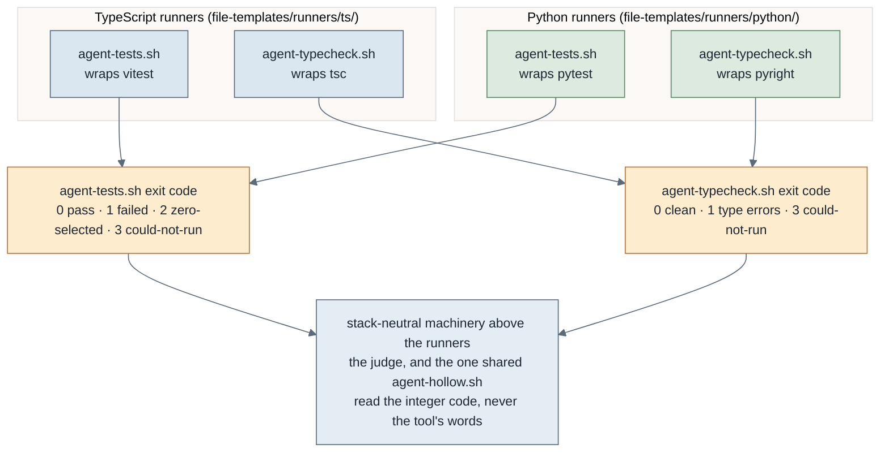

# The Python build path, end to end

How a Python (LangGraph) project goes through the same four phases the pipeline uses for TypeScript, with only the underlying commands changing. The stack-agnostic core (the design partner, the increment-sheet schema, the orchestrator, the checkpoint, modes, profiles, the state schema) never learns the word "Python": all stack knowledge lives in the generator and in the runners the setup gate places. This page is the human walkthrough; its executable form is the `tests/py-e2e-proof` suite, which runs the real pieces.

## The four phases, pointed at Python

1. **Create.** `/omero-create-python-project <name>` runs `scripts/init-python-project.sh`, the second generator (alongside the TypeScript one). It scaffolds a modern src-layout, uv-managed project: `pyproject.toml` with a strict pyright config and a pytest unit/integration tier split (`tests/unit/`, `tests/integration/`), `src/<package>/` with a typed entry module to grow into the LangGraph app, a CI workflow, and git on `main`.

2. **Design.** `/omero-design-sheet` is unchanged: it converges intent into a schema-valid increment sheet. It is stack-agnostic and emits the same sheet shape regardless of stack. `/omero-review-sheet` reviews it for design soundness before build, also stack-agnostic.

3. **Setup.** `/omero-setup-project` runs the gate, which detects the stack from `pyproject.toml`, sources `scripts/setup/python.sh`, and proves the environment by execution: `uv sync` resolves and installs, both pytest tiers run and select a non-zero count, pyright type-checks, coverage runs, and the three agent runners (test, type-check, hollow) are placed from `file-templates/runners/python/` (and the shared hollow runner) and proved. On success it writes the same `.building/setup-ok` receipt as the TypeScript path.

4. **Build.** `/omero-build-full` is unchanged: the orchestrator, branch-per-increment, checkpoint and judge loop are stack-agnostic. The judge runs the same discipline through the placed Python runners: the type-check gate first (pyright), then the unit tier (pytest), then the integration tier, proving a test fails on a deliberate fault (the hollow negative run) and distinguishing a real failure from an environment block. Only the commands underneath differ: pyright not tsc, pytest not vitest, uv not npm.

## The seam that makes this work

The judge and the shared hollow runner read only the runners' **exit codes** (`contracts/agent-runner.md`): `agent-tests.sh` returns 0 pass / 1 failed / 2 zero-selected / 3 could-not-run; `agent-typecheck.sh` returns 0 clean / 1 errors / 3 could-not-run. Both stacks' runners map their native tool onto those codes, so the one shared `agent-hollow.sh` classifies a negative run the same way for either stack. Adding a stack is a new generator plus a runner set honouring this contract; nothing above the runners changes.

## Definition of done, proved

`tests/py-e2e-proof` runs the chain on a LangGraph-shaped increment: scaffold the project, run the setup gate to a READY receipt proved by real pytest and pyright, add a typed graph node with a unit test, then run the judge's sequence through the placed runners (type-check clean, unit tier passes, hollow check ASSERTS on a real fault, and a deliberate type error is caught by the gate). It also asserts the stack-agnostic core contracts (the design partner and the increment-sheet schema) name no stack, so the core stayed agnostic. Where uv, gh, a global git identity or the network is absent the live proof is reported skipped, never silently passed.

Note: `tests/py-e2e-proof` exercises the real generator, setup gate and judge runners directly rather than invoking `/omero-build-full`, because agent-sdlc is the meta-repo that defines the loop, not a project the loop builds. The pieces it runs are the same ones the loop uses.
