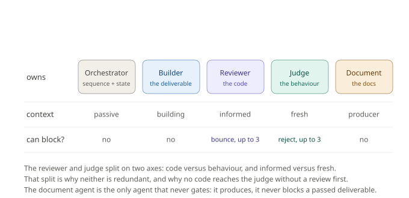
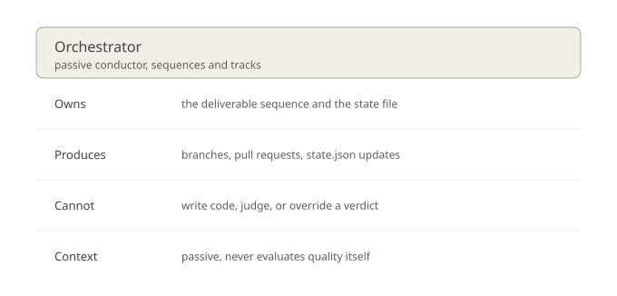
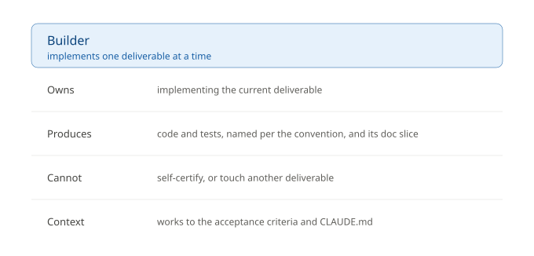
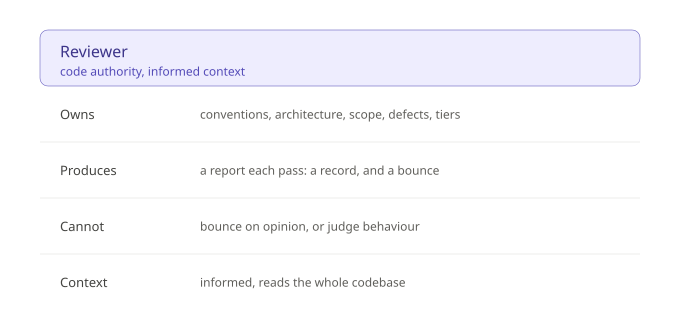
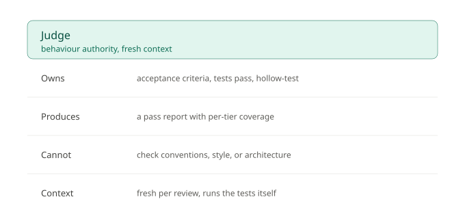
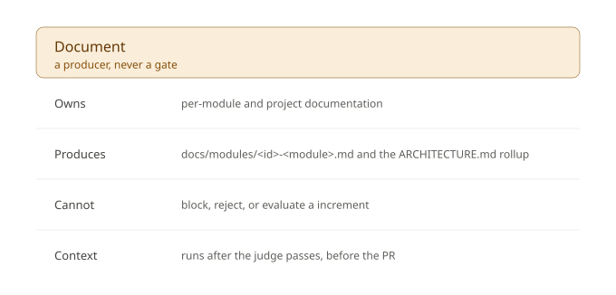

# The four roles

The build loop runs four agent roles plus a passive orchestrator. The split is the point: no single agent both writes code and certifies it. Full definitions live in [`../contracts/build-judge-loop.md`](../contracts/build-judge-loop.md); this page is the summary. The roles are identical in both build modes.

## Orchestrator (passive)

Sequences increments by dependency order, is the sole writer of state.json, enforces the loop budgets, opens PRs, and halts on escalation. It writes no code and makes no judgement. In a normal run it spawns each of the roles below as a subagent with fresh context; see [`diagrams/sequence-spawn.svg`](diagrams/sequence-spawn.svg).

## Builder

Implements one increment against its acceptance criteria, writes the tests, follows the project conventions, and touches only that increment. It does not self-certify. It observes runtime behaviour only through the project's committed runnable surface, never a throwaway script the reviewer and judge cannot see. It also writes its documentation slice for the document agent.

## Reviewer (owns the code)

Informed context: it reads the codebase. It checks conventions, architecture and patterns, scope, code-level defects, and test-tier classification, and can bounce work back to the builder. It is the only conventions gate. Evidence bounces, opinion only suggests: a finding may bounce only if tied to a category with evidence (a cited convention, a named anti-pattern, a scope breach, a concrete defect, a tier misclassification). Everything else is recorded for the human, not sent back.

## Judge (owns behaviour)

Fresh context per review. It type-checks first (a tsc gate, because nothing else type-checks: the tiers run through esbuild and tsx, which strip types), then runs the tests itself rather than trusting reports: the unit tier first (cheap, fail fast), then the integration tier, and it passes only if both pass. It checks the acceptance criteria are met and proves the tests are not hollow with a negative run (a test must fail when the code is deliberately broken). It does not check conventions, style, or architecture; that is the reviewer's job.

## Document

Runs after the judge passes, before the PR. It assembles per-module and project documentation from the builder's payload and the reports. It is a producer, not a gate: it never blocks a passed increment, and a missing input degrades gracefully with the gap marked.

## The ordering invariant

No code reaches the judge without a prior reviewer pass. This holds on the first review and inside every judge cycle (a delta-review precedes each re-judge). Because the reviewer is the only conventions gate, relaxing this would reopen the conventions hole, so it is never relaxed for efficiency.

Flow: builder, then the review loop (budget 3), then the judge loop (budget 3, with a delta-review inside each cycle). Either loop exhausting its three attempts escalates. A downed integration endpoint pauses the run (an environment block) rather than failing the increment. See [`diagrams/error-paths.svg`](diagrams/error-paths.svg) and [`diagrams/endpoint-block.svg`](diagrams/endpoint-block.svg).
