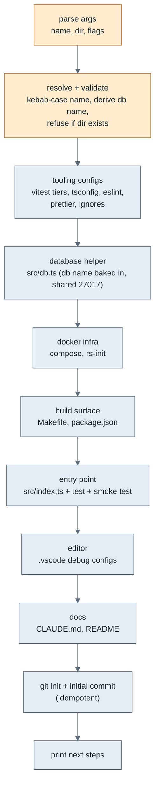
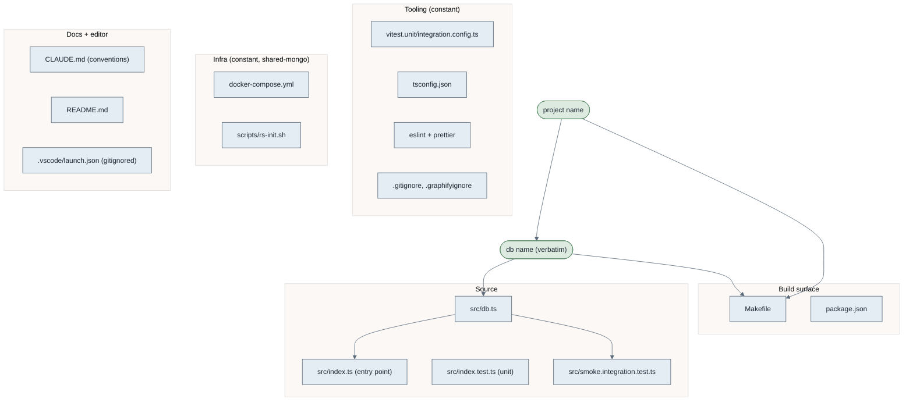
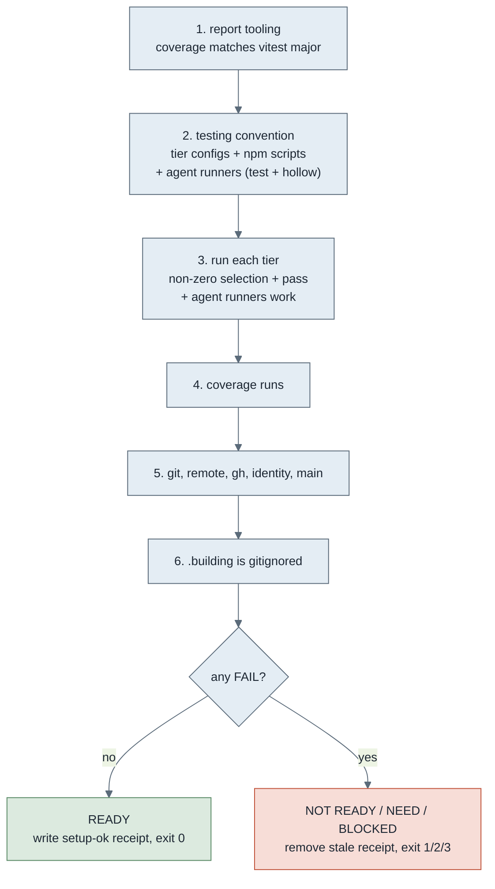

# Scripts

The repo has three shell scripts that stand a project up and prove it ready for
the build loop. This documents what each does and how they connect.

They follow the layout in `contracts/script-layout.md`. The diagrams here are
inline Mermaid (rendered by GitHub) rather than the SVGs catalogued in
`diagram-spec.md`, because a script's documentation is easier to keep in sync
when the diagram lives as text beside the prose.

## How they connect

Three scripts, three jobs: one creates a project, one proves it ready, one is a
small dependency helper the gate also uses. The relationship is create, then
verify, then the loop consumes the receipt.


- **init-ts-mongo.sh** scaffolds a new project from the constant template.
- **project-setup.sh** proves a project is ready by execution, and on success
  writes the `setup-ok` receipt the build loop refuses to start without.
- **ensure-report-tooling.sh** is a focused helper that installs and verifies the
  coverage tooling the judge needs. The gate folds the same check into step 1, so
  this script is the standalone version of that one concern.

The receipt is the bridge: the generator creates, the gate verifies and stamps,
the loop consumes the stamp.

---

## init-ts-mongo.sh (the generator)

Scaffolds a backend TypeScript + MongoDB project: tooling, infra, the db helper,
an entry point, conventions, then inits git. It makes no domain assumptions; you
grow `src/index.ts` and add your own modules.

```
init-ts-mongo.sh <project-name> [target-dir] [--verbose] [--no-color] [--debug]
```

- `--verbose` prints each file as it is written.
- `--no-color` forces plain output (colour is auto-detected and on only at a
  terminal).
- `--debug` traces every shell command.

### Generation flow

What the script does, in order. It resolves and validates every input before it
writes anything, then writes each area, then inits git.



### Scaffold components

What lands in a generated project, grouped, with the parameters that flow into
each. The project name is the only varying input; everything else, including the
shared compose and the fixed port, is constant.



The entry point and the smoke test both use `src/db.ts`, so the database helper
is exercised from birth: the unit tier tests the entry point, the integration
tier runs a generic Mongo connectivity smoke test through the real helper.

### What it does not do

Deliberately separate, so create and verify stay distinct: it does not run
`npm install`, bring up Docker, provision graphify, or run the setup gate. After
generating, the project still needs install, bring-up, and the gate.

---

## project-setup.sh (the gate)

Proves a project is ready to build, by execution not assertion. Idempotent, acts
only on the gap. On READY it writes `.building/build/setup-ok`, the receipt the
build loop checks.

```
project-setup.sh            check; ask before installing or scaffolding
project-setup.sh --yes      install and scaffold gaps without asking
project-setup.sh --check    verify only; never install or scaffold
```

Exit codes: 0 READY, 1 NOT READY (fix the FAIL lines), 2 needs `--yes`, 3 BLOCKED
(endpoint down).

### What it checks



Each check is one of OK (pass), FAIL (must fix, exit 1), NEED (needs `--yes` to
install or scaffold, exit 2), or BLOCK (endpoint down, exit 3). The gate
accumulates failures and decides the exit code at the end, which is why it runs
without `set -e`.

The identity check is load-bearing for attribution: the loop's commits must be
authored by an email on the allowlist so they map to the right GitHub account.
Override the allowlist per machine with `GIT_IDENTITY_ALLOWLIST`.

The agent test runner (`.building/scripts/agent-tests.sh`) is part of the testing
convention the gate scaffolds and proves. It is the path the build loop's judge
uses to run tests: terse one-line output on pass, full output on failure, so the
judge's repeated verification runs cost a few tokens of context rather than the
whole vitest dump each time. Humans keep the verbose path (`npm run test:unit`,
`make test`); both drive the same tier configs, so they never disagree on what
they test. The gate places the runner from the shared template if absent or out of
date (step 2) and runs it to prove the agent path works before stamping ready
(step 3). A project whose human tests pass but whose agent runner is broken is
not loop-ready, because the judge depends on that path.

The hollow-check runner (`.building/scripts/agent-hollow.sh`) is placed and proven the same
way. It is the single command the judge uses for the hollow-test negative run: it
backs up the file, applies the judge's behavioural fault, runs the scoped tier,
restores the file from an exit trap, then re-verifies green, returning a verdict
by exit code. Setup writes it from the template if absent or out of date (step 2) and
proves it is runnable (step 3) on the same loop-ready footing as the test runner.

### Modes

- default (ask): reports gaps and, at a terminal, asks before installing or
  scaffolding.
- `--yes`: installs and scaffolds gaps without asking.
- `--check`: reports only, never changes anything. Use this to verify without
  side effects.

---

## ensure-report-tooling.sh (dependency helper)

A focused helper that ensures the repo has the coverage tooling the judge report
needs (`@vitest/coverage-v8`) and verifies a coverage run works. Idempotent.

```
ensure-report-tooling.sh            ask before installing (at a terminal)
ensure-report-tooling.sh --yes      install without asking
ensure-report-tooling.sh --check    report only, never install (exit 2 if missing)
```

The gate's step 1 covers the same ground (it derives the required coverage major
from the installed vitest). This script is the standalone, single-concern version
for when you want to fix just the report tooling without running the whole gate.
