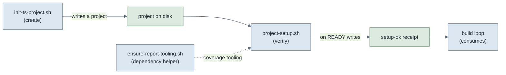
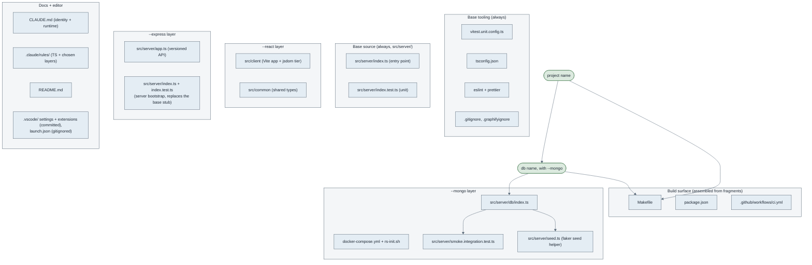
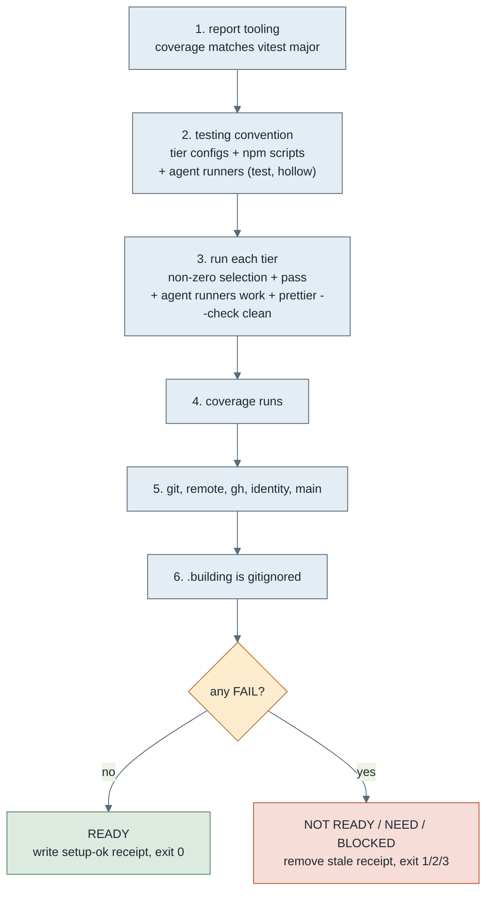

# Scripts

The pipeline scripts stand a project up and prove it ready for the build loop:
the generator, the setup gate, and a small dependency helper, plus the sheet
validator that gates the build loop's input. This documents what each does and how
they connect. (The repo also has scripts outside the pipeline:
the per-project rules installer, documented in [`project-rules.md`](project-rules.md),
the global git-hooks and Claude-rules installers, documented in
[`../hooks/`](../hooks/README.md) and [`project-rules.md`](project-rules.md), and the
skills installer (`skills/install-skills.sh`), documented in
[`../skills/`](../skills/README.md). Those are not part of the create-verify-build
flow described here.)

They follow the layout in `contracts/script-layout.md`. The diagrams here are
inline Mermaid (rendered by GitHub) rather than standalone SVGs, because a script's
documentation is easier to keep in sync when the diagram lives as text beside the
prose.

## How they connect

The pipeline scripts, one job each: one creates a project, one proves it ready, one
is a small dependency helper the gate also uses, and one validates the sheet the
build loop is about to build. The first three are the create-verify-build
environment flow (create, then verify, then the loop consumes the receipt); the
validator gates a different input, the sheet, at the loop's entry.



- **init-ts-project.sh** scaffolds a new project: a TypeScript base, plus optional Mongo, React and Express layers.
- **project-setup.sh** proves a project is ready by execution, and on success
  writes the `setup-ok` receipt the build loop refuses to start without.
- **ensure-report-tooling.sh** is a focused helper that installs and verifies the
  coverage tooling the judge needs. The gate folds the same check into step 1, so
  this script is the standalone version of that one concern.

The receipt is the bridge: the generator creates, the gate verifies and stamps,
the loop consumes the stamp.

---

## init-ts-project.sh (the generator)

Scaffolds a TypeScript project with optional Mongo, React and Express layers. The base
is always TypeScript (tooling, an entry point, a unit tier under `src/server`); `--mongo`
adds the db helper, docker infra, the integration tier and a faker seed; `--react`
adds the React + Vite client under `src/client`; `--express` replaces the stub entry
point with a versioned Express HTTP server (`src/server/app.ts`) and its supertest unit
tests, and with `--mongo` the server's shutdown closes the shared client. It inits git,
installs the matching stack rules, and emits a layer-aware GitHub Actions workflow
(`.github/workflows/ci.yml`). It makes no domain assumptions; you grow
`src/server/index.ts` and add your own modules.

When any service layer is present it also writes `config/services.yaml`: the ports and
addresses for the server, the mongo and the client, each block contributed by its layer.
`scripts/config-env.sh` (run via `make config`) turns the YAML into a gitignored `.env`
that the server (`--env-file-if-exists`), the Vite client (`loadEnv`) and docker compose
(`${MONGO_PORT}`) all read, so a project's ports and addresses live in one file and you
can run several instances by config alone. The code defaults match the YAML, so a fresh
checkout runs without regenerating.

It is a small multi-file script (per `contracts/script-layout.md`): an orchestrator
that sources the shared helpers (`scripts/generator/lib.sh`) and the
`scripts/generator/base.sh`, `mongo.sh`, `react.sh`, `express.sh` layers, assembling the
shared files (package.json, tsconfig, Makefile) from the fragments each enabled layer
contributes.

```
init-ts-project.sh <project-name> [target-dir] [--mongo] [--react] [--express] [--verbose] [--no-color] [--debug]
```

- `--mongo` adds the MongoDB layer; `--react` adds the React client layer; `--express` adds the Express server layer; any combination is valid.

- `--verbose` prints each file as it is written.
- `--no-color` forces plain output (colour is auto-detected and on only at a
  terminal).
- `--debug` traces every shell command.

### Generation flow

What the script does, in order. It resolves and validates every input before it
writes anything, then writes each area, then inits git.

```mermaid
%%{init: {'theme':'base','themeVariables':{'primaryColor':'#e4edf4','primaryTextColor':'#1d2733','primaryBorderColor':'#5b6b7a','lineColor':'#5b6b7a','fontSize':'14px'}}}%%
flowchart TD
    args["parse args<br/>name, dir, flags"] --> resolve["resolve + validate<br/>kebab-case name, derive db name,<br/>refuse if dir exists"]
    resolve --> tooling["base: tooling configs<br/>vitest unit, tsconfig, eslint,<br/>prettier, ignores"]
    tooling --> entry["base: entry point<br/>src/server/index.ts + unit test"]
    entry --> editor["base: editor configs<br/>.vscode settings, extensions, debug"]
    editor --> mongo["--mongo (optional)<br/>db helper (src/server/db),<br/>docker infra, integration tier + seed"]
    mongo --> react["--react (optional)<br/>src/client (Vite), src/common,<br/>frontend tier"]
    react --> express["--express (optional)<br/>versioned Express server<br/>(src/server/app.ts) + supertest tests"]
    express --> build["assemble shared files<br/>package.json, tsconfig, Makefile,<br/>.github/workflows/ci.yml<br/>(from base + layer fragments)"]
    build --> docs["docs<br/>CLAUDE.md (identity + runtime), README"]
    docs --> git["git init + initial commit<br/>(idempotent)"]
    git --> rules["stack rules<br/>install-project-rules.sh --typescript [--mongo] [--react]"]
    rules --> done["print next steps"]

    classDef io fill:#fdeccd,stroke:#b8743d,color:#1d2733;
    classDef work fill:#e4edf4,stroke:#5b6b7a,color:#1d2733;
    class args,resolve,done io;
    class tooling,entry,editor,mongo,react,express,build,docs,git,rules work;
```



### Scaffold components

What lands in a generated project, grouped, with the parameters that flow into
each. The project name is the only varying input; everything else, including the
shared compose and the fixed port, is constant.



The entry point, the seed helper and the smoke test all use `src/server/db/index.ts`,
so the database helper is exercised from birth: the unit tier tests the entry point, and
the integration tier runs a replica-set smoke test through the real helper (it
asserts the set reports a PRIMARY, so it fails if mongod is down or the replica
set was never initiated). The seed helper (`make seed`, faker-backed) proves the
faker to Mongo path end to end and is a domain-free starting point you grow.

### CI workflow

The generator writes `.github/workflows/ci.yml`, assembled from layer fragments like
the Makefile and `package.json`. The base contributes a job each for `lint`,
`format:check`, `typecheck` (one `tsc --noEmit` spans all of `src`, so it covers the
client too) and the unit tier; `--mongo` appends an `integration` job that runs `make
up` then `seed` then the integration tier on a real mongod; `--react` appends a
`client` job running the frontend tier, which is where client component tests are
gated. It triggers on every pull request into `main`, which is what the build loop
opens per increment, so each increment is checked before you merge it. The jobs use
`npm ci`, so the project's `package-lock.json` must be committed (`npm install` writes
it). On a project with no remote the loop never opens a PR, so the workflow simply
never runs.

### What it does not do

Deliberately separate, so create and verify stay distinct: it does not run
`npm install`, bring up Docker, provision graphify, or run the setup gate. After
generating, the project still needs install, bring-up, and the gate.

---

## project-setup.sh (the gate)

Proves a project is ready to build, by execution not assertion. Idempotent, acts
only on the gap. On READY it writes `.building/setup-ok`, the receipt the
build loop checks.

```
project-setup.sh            set up: install and scaffold gaps as needed (default)
project-setup.sh --check    verify only; never install, scaffold or push
```

Exit codes: 0 READY, 1 NOT READY (fix the FAIL lines), 2 NOT READY (`--check`
found setup to apply, re-run without `--check`), 3 BLOCKED (endpoint down).

### What it checks



Each check is one of OK (pass), FAIL (must fix, exit 1), NEED (`--check` found an
install or scaffold to do, exit 2), or BLOCK (endpoint down, exit 3). The gate
accumulates failures and decides the exit code at the end, which is why it runs
without `set -e`.

The identity check is load-bearing for attribution: the loop's commits must be
authored by an email on the allowlist so they map to the right GitHub account.
The allowlist is read from git config `sdlc.identityAllowlist` (space-separated),
so no email is baked into the repo; set it once globally, or via
`setup-global-git-hooks.sh install`. Unset is a FAIL.

The agent test runner (`.building/scripts/agent-tests.sh`) is part of the testing
convention the gate scaffolds and proves. It is the path the build loop's judge
uses to run tests: terse one-line output on pass, full output on failure, so the
judge's repeated verification runs cost a few tokens of context rather than the
whole vitest dump each time. Humans keep the verbose path (`npm run server:test:unit`,
`make test`); both drive the same tier configs, so they never disagree on what
they test. The gate places the runner from the shared template if absent or out of
date (step 2) and runs it to prove the agent path works before stamping ready
(step 3). A project whose human tests pass but whose agent runner is broken is
not loop-ready, because the judge depends on that path.

The hollow-check runner (`.building/scripts/agent-hollow.sh`) is placed and proven the same
way. It is the single command the judge uses for the hollow-test negative run: it
backs up the file, applies the judge's behavioural fault, runs the scoped tier,
restores the file from an exit trap, then re-verifies green, returning a verdict
by exit code. Setup writes it from the template if absent or out of date (step 2) and
proves it is runnable (step 3) on the same loop-ready footing as the test runner.

The type-check runner (`.building/scripts/agent-typecheck.sh`, from the stack's
template) is the judge's gate, run first before the tiers because nothing else
type-checks: the tiers run through esbuild and tsx, which strip types. A clean
type-check (exit 0) is required to pass; a type error (exit 1) is a hard fail like a
failing test, and a type-check that cannot run at all (exit 3, no tsconfig or tsc
absent) is an environment block. The setup gate places all three agent runners
(test, hollow-check and type-check) and proves each runnable, so one actor owns
runner placement; the build loop's judge runs the type-check per increment.

### Modes

- default: sets up. Installs and scaffolds gaps and pushes main as needed,
  idempotently (acts only on the gap). Invoking the gate is the consent.
- `--check`: reports only, never changes anything. Use this to verify without
  side effects (exit 2 if setup is needed).

---

## ensure-report-tooling.sh (dependency helper)

A focused helper that ensures the repo has the coverage tooling the judge report
needs (`@vitest/coverage-v8`), matching the installed vitest major, and verifies a
coverage run works. Idempotent.

```
ensure-report-tooling.sh            install or realign if missing/mismatched (default)
ensure-report-tooling.sh --check    report only, never install (exit 2 if missing/mismatched)
```

It does the same major-matching as the gate's step 1 (derives the required
coverage major from the installed vitest and pins the install to it). This is the
standalone, single-concern version for fixing just the report tooling without
running the whole gate.

---

## validate-sheet.sh (the sheet validator)

The build loop's entry gate on its input: it validates a sheet against the
mechanical rules of the sheet schema before any role runs, so a malformed sheet
fails loud rather than reaching the builder as garbled prose. Read-only.

```
validate-sheet.sh <sheet.md>     validate, one line per rule, verdict last
validate-sheet.sh --help         print the header
```

Which rules it checks, the exit-code meanings, and the defect-vs-rejection
distinction (a cycle is an upstream bug to regenerate, a missing field is a fixable
flaw) are the schema's, in
[`../contracts/increment-sheet.schema.md`](../contracts/increment-sheet.schema.md)
(Validation tooling). The build loop calls it on entry (build-judge-loop.md); the
design partner can self-check before hand-off. Its tests and fixtures live under
`tests/`, run on every PR into main.

---

## validate-state.sh (the state validator)

Validates a build-loop state file against the rules of the state schema, on the
post-sync `state.json` (after the loop syncs the sheet in, before it acts), so a
corrupted or hand-edited recovery record fails loud rather than being acted on.
Read-only.

```
validate-state.sh <state.json> <sheet.md>   validate, one line per rule, verdict last
validate-state.sh --help                     print the header
```

It always checks its inputs: the state-vs-sheet rules need the sheet, so it
re-validates the sheet first rather than trusting it. The nine rules, the exit
codes, and the defect-vs-rejection distinction (a state<->sheet disagreement is an
upstream desync to reconcile, a bad count is a fixable flaw) are the schema's, in
[`../contracts/state.schema.md`](../contracts/state.schema.md) (Validation tooling).
The build loop calls it on re-entry (build-judge-loop.md, Resume). Its tests and
fixtures live under `tests/`, run on every PR into main.

---

## board-state.sh (the board computer)

Computes the build loop's checkpoint board from `state.json` and the sheet: every
`depends_on` computation the orchestrator and the document agent would otherwise do
by hand. An LLM hand-computing longest-path-with-ties drifts, yet the board must
render byte-identical across conversations, so a script owns it. Read-only; the
orchestrator stays the sole writer of `state.json`.

```
board-state.sh <state.json> <sheet.md>   emit the board-state JSON
board-state.sh --help                     print the header
```

It emits one JSON object: the four-section partition (ready, awaiting_merge,
blocked, possibly_stalled), the critical-path star set (the longest dependency
chain, ties included), the ready set, the per-mode cut-rule boolean, and the
coloured Mermaid graph. The orchestrator pastes the board into its verbatim
template (build-judge-loop.md, The board); the document agent embeds the same
Mermaid (document-agent.md), so the two never drift. It always checks its inputs,
running `validate-state.sh` first (exit 2 if the pair fails). Its tests assert the
computed board against graphs worked out by hand; fixtures under `tests/`.
